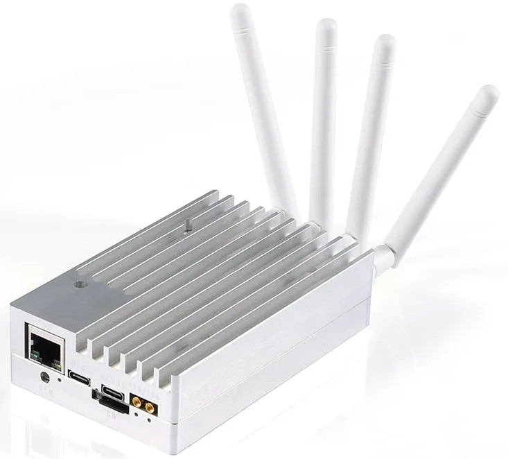

# Custom HDL and C sources for libresdr board based on Zynq 7020

- Requirements: Vivado 2022.2 and Vitis 2022.2

- To do: add driver based on [no-OS](https://github.com/analogdevicesinc/no-OS.git)
